#  Notes App - Flutter

# Présentation
Application de prise de notes avec authentification sécurisée développée avec Flutter et Appwrite.

# screenshots 
## RegisterScreen
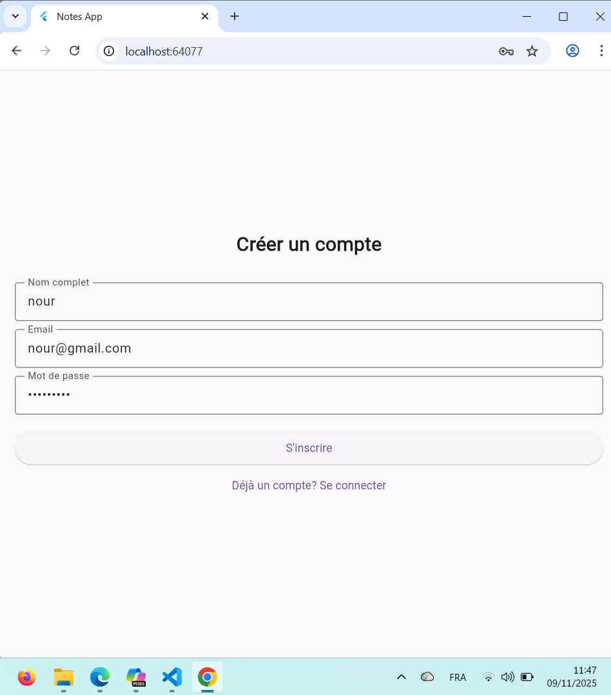
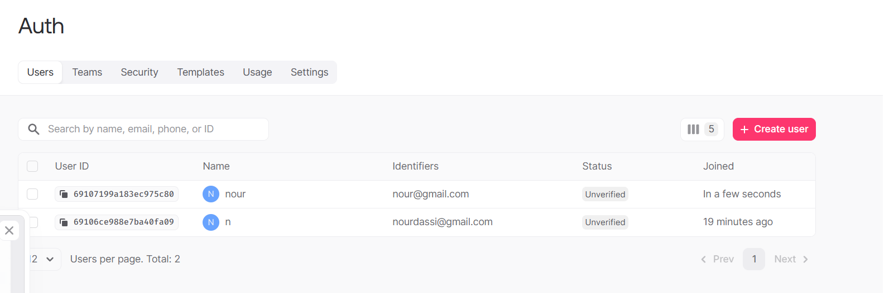
## NoteScreen 

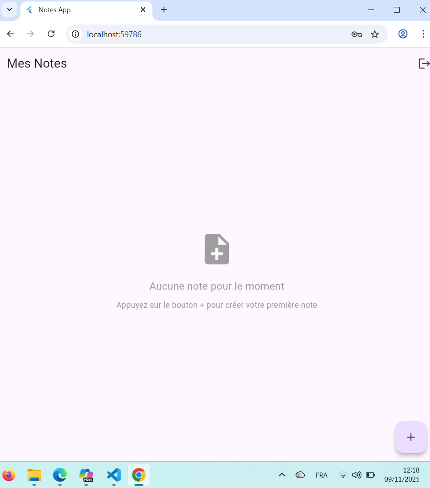

## Add Note
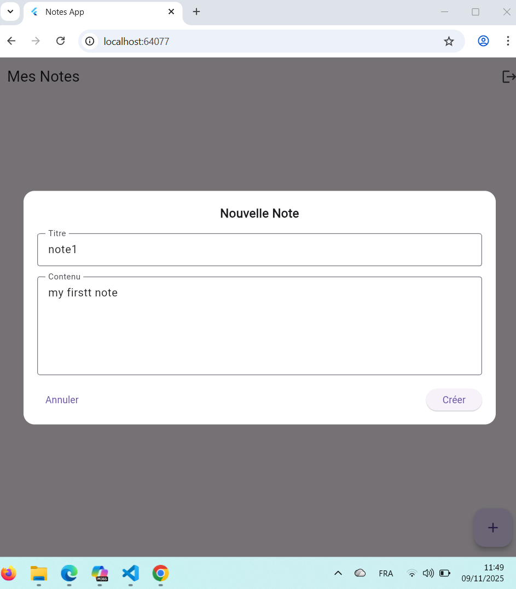
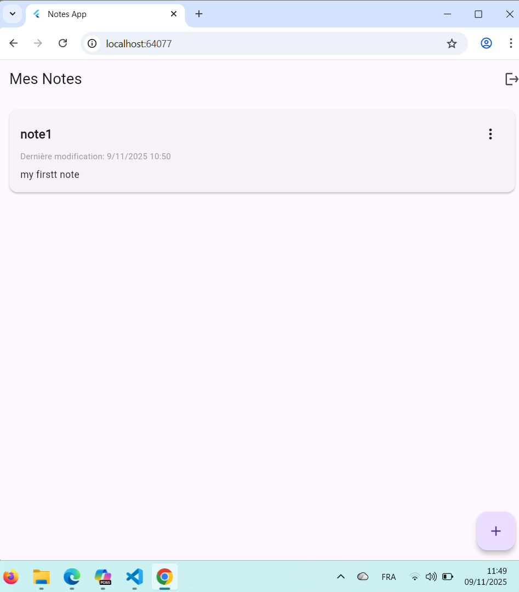
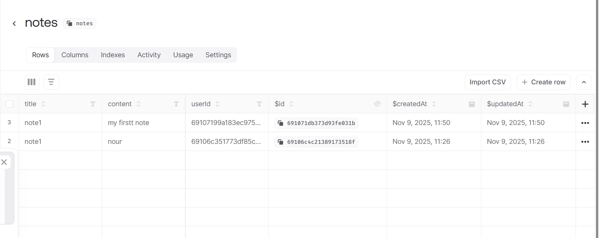
## Edit Note
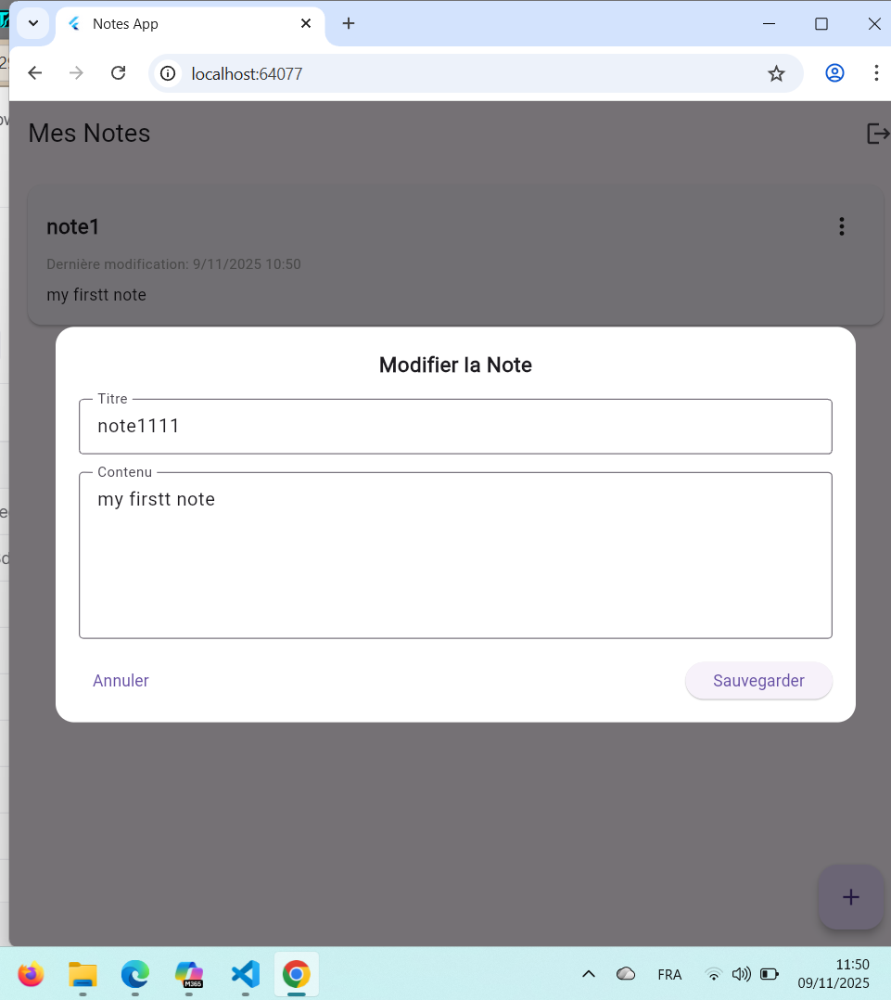
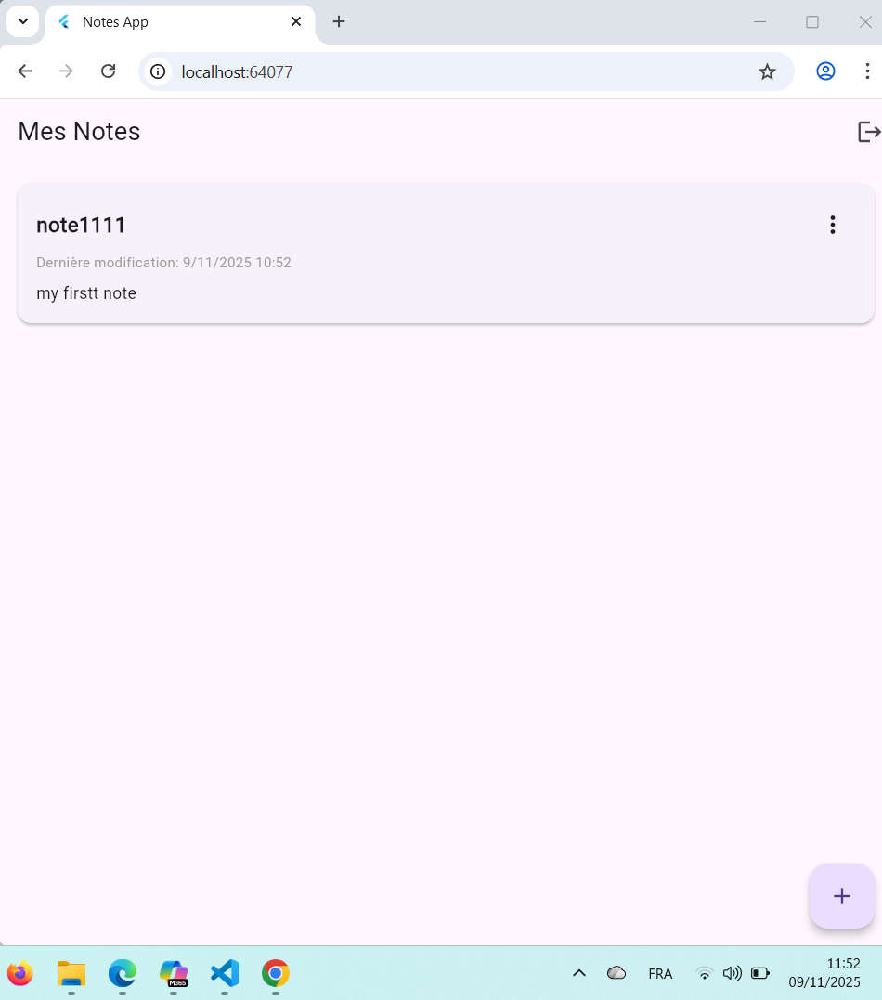

## Delete Note
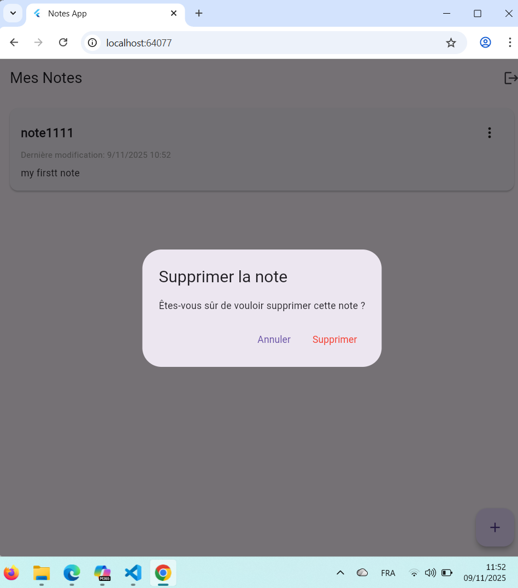
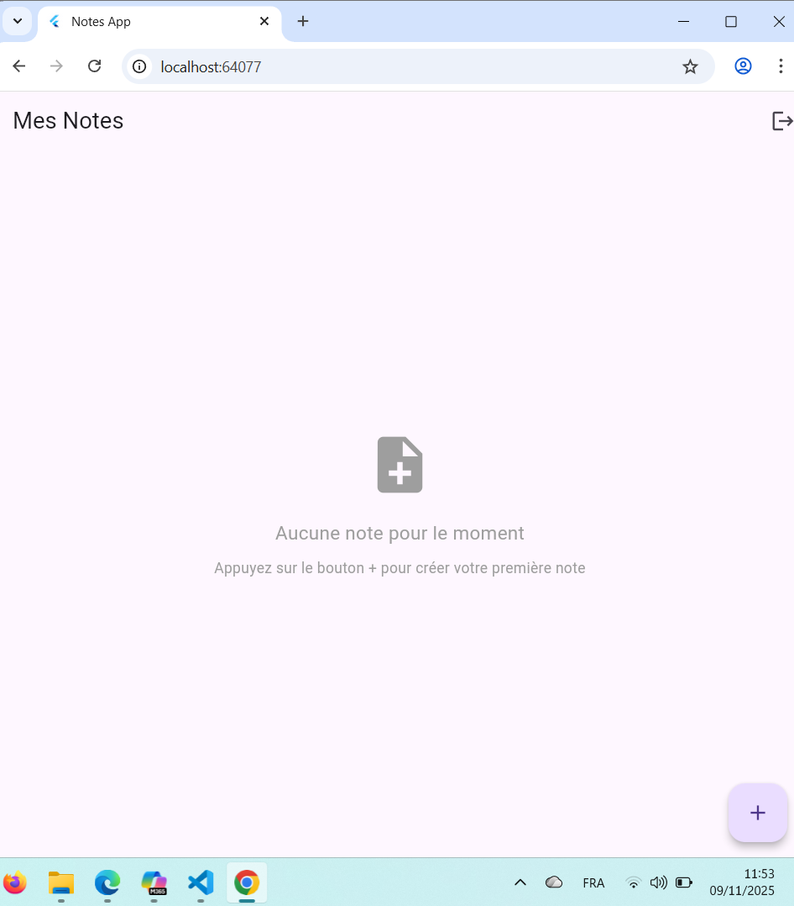
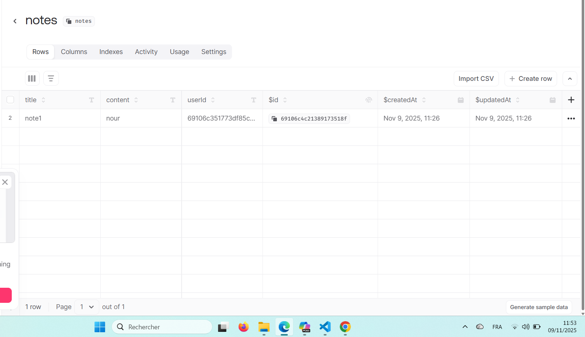

# Fonctionnalités
Authentification utilisateur

Création, lecture, modification et suppression de notes

Données isolées par utilisateur

Interface moderne

Support multi-plateforme
# Technologies
- **Flutter** - Framework UI
- **Appwrite** - Backend
- **Dart** - Langage

# Configuration 
1. git clone https://github.com/Nour4git/lab2_Flutter-.git
2. cd notes_app
3. flutter pub get

# Configuration de fichier .env 
APPWRITE_ENDPOINT=https://cloud.appwrite.io/v1
APPWRITE_PROJECT_ID=votre-id
APPWRITE_DATABASE_ID=notes_db
APPWRITE_COLLECTION_ID=notes

# lancer
flutter run 

